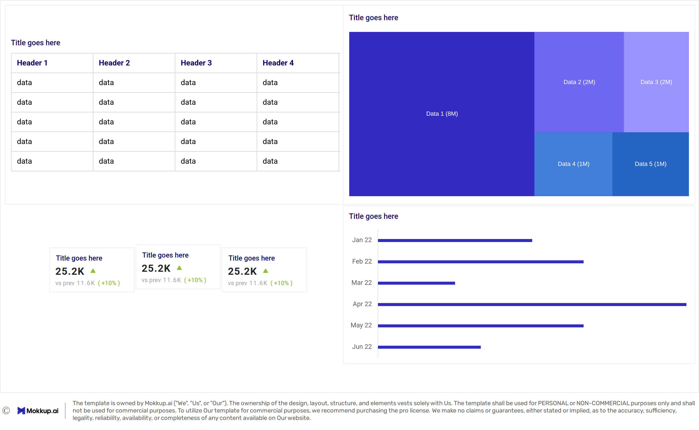

# Data Portfolio


# Table of contents

- [Objective](#objective)
- [Data Source](#data-source)
- [Stages](#stages)
- [Design](#design)
  - [Mockup](#mockup)
  - [Tools](#tools)
- [Development](#development)
  - [Pseudocode](#pseudocode)
  - [Data Exploration](#data-exploration)
  - [Data Cleaning](#data-cleaning)
  - [Transform the Data](#transform-the-data)
  - [Create the SQL View](#create-the-sql-view)
- [Testing](#testing)
  - [Data Quality Tests](#data-quality-tests)
- [Visualization](#visualization)
  - [Results](#results)
  - [DAX Measures](#dax-measures)
- [Analysis](#analysis)
  - [Findings](#findings)
  - [Validation](#validation)
  - [Discovery](#discovery)
- [Recommendations](#recommendations)
  - [Potential ROI](#potential-roi)
  - [Potential Courses of Actions](#potential-courses-of-actions)
- [Conclusion](#conclusion)

---

## Objective
What is the key pain point?
The Head of Marketing wants to find out who the top YouTubers are in 2025 to decide on which YouTubers would be best to run marketing campaigns throughout the rest of the year.

What is the ideal solution?
To create a dashboard that provides insights into the top UK YouTubers in 2025 that includes their

subscriber count
total views
total videos, and
engagement metrics
This will help the marketing team make informed decisions about which YouTubers to collaborate with for their marketing campaigns.

### Key business problem
The Head of Marketing needs to identify the top-performing UK YouTubers in 2025 in order to determine which creators are best suited for marketing campaigns throughout the year.

Currently, there is no consolidated view that compares YouTube channels using consistent performance and engagement metrics, making it difficult to make data-driven collaboration decisions.

### Ideal solution
Create an interactive dashboard that provides insights into the **top UK YouTubers in 2025**, including:

- Subscriber count  
- Total video views  
- Total number of uploaded videos  
- Engagement metrics  

This dashboard will enable the marketing team to objectively evaluate creators and select YouTubers who are most likely to deliver effective and high-impact marketing campaigns.

---

## User Story

**As the Head of Marketing**,  
I want to use a dashboard that analyses YouTube channel data for creators based in the UK,  
so that I can identify the highest-performing YouTube channels using metrics such as subscriber count, total views, and engagement.

With these insights, I can make informed decisions about which YouTubers to collaborate with, maximising the effectiveness and return on investment of marketing campaigns in 2025.

## Data Source
-What data is needed to achieve our objective?
 We need data on the top UK YouTubers in 2024 that includes their

-channel names

-total subscribers

-total views

-total videos uploaded

Where is the data coming from? The data is sourced from Kaggle (an Excel extract), see here to find it.
### Data requirements
To achieve the project objective, the following data is required for **top UK YouTubers in 2025**:

- Channel name  
- Total subscriber count  
- Total video views  
- Total number of videos uploaded

### Data origin
The dataset is sourced from **Kaggle** and provided as an **Excel extract** containing aggregated YouTube channel statistics.

> 🔗 Dataset link: *[https://www.kaggle.com/datasets/bhavyadhingra00020/top-100-social-media-influencers-2024-countrywise?resource=download]*

This dataset enables analysis of channel size, reach, and engagement performance across UK-based creators.

## Stages
The project follows a structured analytics workflow to ensure clarity, accuracy, and reproducibility:

- **Design** – Define business questions and dashboard requirements  
- **Development** – Explore, clean, transform, and model the data  
- **Testing** – Validate data quality and metric accuracy  
- **Analysis** – Generate insights and validate findings  

---

## Design
### Dashboard components required

To meet the business requirements, the dashboard must answer the following key questions:

1. Who are the **top 10 UK YouTubers** by subscriber count in 2025?  
2. Which **3 channels** have uploaded the most videos?  
3. Which **3 channels** have the highest total views?  
4. Which **3 channels** have the highest **average views per video**?  
5. Which **3 channels** have the highest **views-to-subscriber ratio**?  
6. Which **3 channels** show the highest **subscriber engagement per video uploaded**?

These questions may evolve as insights are discovered during the analysis phase.

---

### Dashboard Mockup




#### Visuals considered
To effectively answer the business questions, the following visualisations are used:

1. Table (detailed channel comparison)  
2. Treemap (relative channel size by subscribers or views)  
3. Scorecards (headline KPIs)  
4. Horizontal bar charts (rankings and comparisons)  

These visuals are designed to be intuitive for non-technical stakeholders while supporting data-driven decision-making.

### Tools

| Tool        | Purpose |
|------------|----------|
| Excel      | Exploring the data |
| SQL Server | Cleaning, testing, and analyzing the data |
| Power BI   | Visualizing the data via interactive dashboards |
| GitHub     | Hosting the project documentation and version control |
| Mokkup AI  | Designing the wireframe/mockup of the dashboard |

## Development

### Pseudocode
- What's the general approach in creating this solution from start to finish?
1.Get the data
2.Explore the data in Excel
3.Load the data into SQL Server
4.Clean the data with SQL
5.Test the data with SQL
6.Visualize the data in Power BI
7.Generate the findings based on the insights
8.Write the documentation + commentary
Publish the data to GitHub Pages

## Visualization
### Results


### DAX Measures
#### 1.Total Subcribers (M)
```DAX
Total Subscribers (M) =
VAR million = 1000000
VAR sumOfSubscribers = SUM(view_uk_youtubers_2024[total_subscribers])
VAR totalSubscribers = DIVIDE(sumOfSubscribers, million)

RETURN totalSubscribers
```
#### 2.Total Views(B)
```DAX
Total Views (B) = 
VAR billion = 1000000000
VAR sumOfTotalViews = SUM(view_uk_youtubers_2024[total_views])
VAR totalViews = ROUND(sumOfTotalViews / billion, 2)

RETURN totalViews
```
#### 3. Total Videos
```DAX
Total Videos = 
VAR totalVideos = SUM(view_uk_youtubers_2024[total_videos])

RETURN totalVideos
```
#### 4. Average Views Per Video
```DAX
Average Views per Video (M) = 
VAR sumOfTotalViews = SUM(view_uk_youtubers_2024[total_views])
VAR sumOfTotalVideos = SUM(view_uk_youtubers_2024[total_videos])
VAR  avgViewsPerVideo = DIVIDE(sumOfTotalViews,sumOfTotalVideos, BLANK())
VAR finalAvgViewsPerVideo = DIVIDE(avgViewsPerVideo, 1000000, BLANK())

RETURN finalAvgViewsPerVideo
```
#### 5.Subscriber Engangement Rate
```DAX
Subscriber Engagement Rate = 
VAR sumOfTotalSubscribers = SUM(view_uk_youtubers_2024[total_subscribers])
VAR sumOfTotalVideos = SUM(view_uk_youtubers_2024[total_videos])
VAR subscriberEngRate = DIVIDE(sumOfTotalSubscribers, sumOfTotalVideos, BLANK())
RETURN subscriberEngRate 
```
#### 6.Views Per Subscriber

```DAX
Views Per Subscriber = 
VAR sumOfTotalViews = SUM(view_uk_youtubers_2024[total_views])
VAR sumOfTotalSubscribers = SUM(view_uk_youtubers_2024[total_subscribers])
VAR viewsPerSubscriber = DIVIDE(sumOfTotalViews, sumOfTotalSubscribers, BLANK())

RETURN viewsPerSubscriber 
```
## Analysis
### Findings
What did we find?
For this analysis, we're going to focus on the questions below to get the information we need for our marketing client -

Here are the key questions we need to answer for our marketing client:

1.Who are the top 10 YouTubers with the most subscribers?
2.Which 3 channels have uploaded the most videos?
3.Which 3 channels have the most views?
4.Which 3 channels have the highest average views per video?
5.Which 3 channels have the highest views per subscriber ratio?
6.Which 3 channels have the highest subscriber engagement rate per video uploaded?
|Rank| Channel Name| Subscribers |
|----|-------------|-------------|
|1   | NocopyrightSounds| 34.20  |
|2   | DanTDM           | 29.90  |
|3   | Dan Rhodes       | 26.50  |
|4   | Miss Katy        | 25.60  |
|5   | Mister Max       | 25.20  |
|6   | KSI              | 24.90  |
|7   | Dua Lipa         | 24.50  |
|8   | Jelly            | 23.40  |
|9   | Sidemen          | 22.80  |
|10  | Mrwhosetheboss   | 21.90  |
### Validation

### Discovery

## Recommendations

### Potential ROI

### Potential Courses of Actions

## Conclusion
